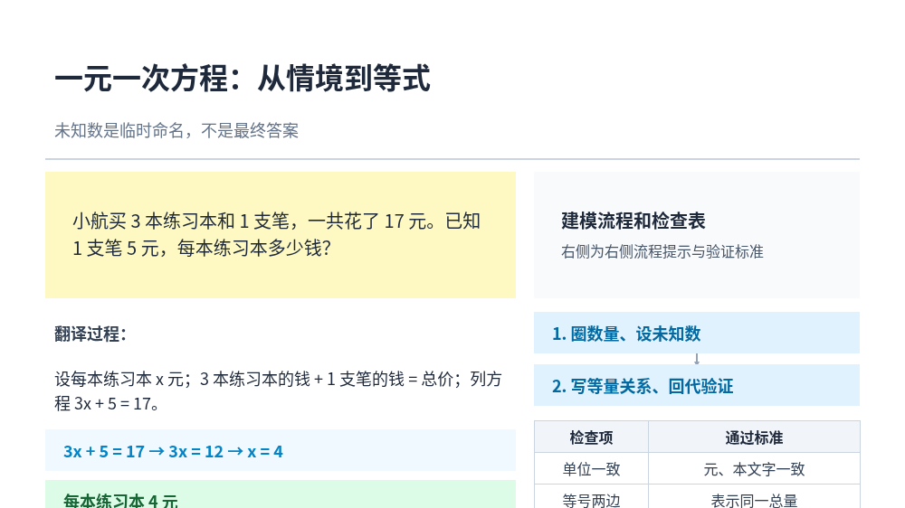
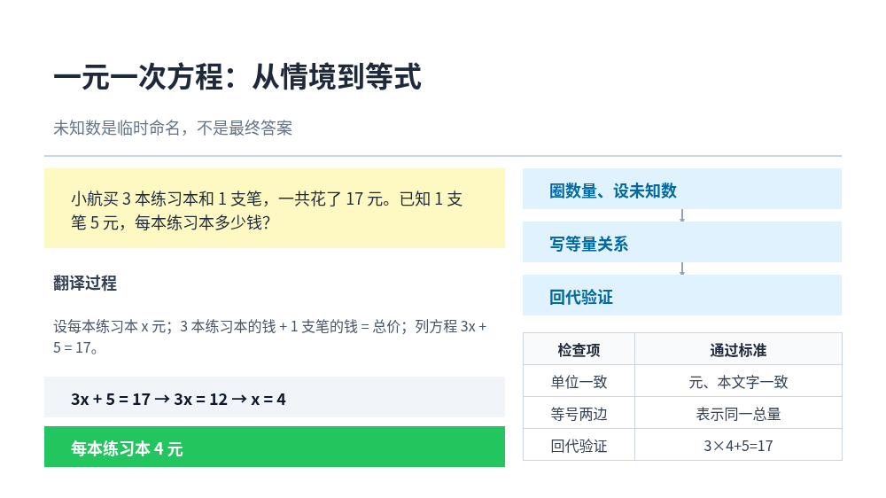

# CogEvol-4B — On-Device Learning-Environment Generation

**A 4B-post-trained model that turns a one-line course brief into a complete learning artifact — structured slide JSON *and* self-contained interactive HTML — in a single forward pass, fully offline on a laptop.**

<p align="center">
  <a href="https://huggingface.co/CogEvol/CogEvol-4B"></a>
  <a href="https://huggingface.co/CogEvol/CogEvol-4B-Q4_K_M-GGUF"></a>
  <a href="LICENSE"></a>
  <a href="#12-license--citation"></a>
  <br/>
  
  
  
</p>

- 🧠 Base: Qwen3.5-4B hybrid architecture (48 GDN linear-attention layers + 16 full-attention layers) → mix SFT (53,687 production-verified samples) → slide RL → HTML RL
- 📦 One quantized file: **Q4_K_M GGUF, 2.4 GB** — runs on Apple Silicon / any CUDA or CPU box via llama.cpp
- ⚡ **~33 tok/s generation / ~470 tok/s prefill on a MacBook Pro M2 Pro (16 GB)** — a full interactive course in ~6 minutes, no GPU cluster, no API keys
- 🔌 **Zero external dependencies at inference**: model + app + assets all local. The demo below runs with WiFi switched off
- 🎓 Works with [OpenMAIC](https://github.com/THU-MAIC/OpenMAIC) out of the box (local provider via `.env.local`), plus a patch that adds a runtime *brief expander* and fully-offline widget rendering (§7)

| Model | Link | License |
|---|---|---|
| **CogEvol-4B** (BF16 safetensors) | <https://huggingface.co/CogEvol/CogEvol-4B> | Apache 2.0 |
| **CogEvol-4B Q4_K_M GGUF** (2.4 GB, llama.cpp) | <https://huggingface.co/CogEvol/CogEvol-4B-Q4_K_M-GGUF> | Apache 2.0 |

> This repository contains **code only**: serving scripts, the OpenMAIC integration patch, and evaluation tooling. Weights live on HuggingFace.

[中文文档 (README_zh.md)](README_zh.md)

---

## Table of contents

1. [What CogEvol-4B does](#1-what-cogevol-4b-does)
2. [Repository layout](#2-repository-layout)
3. [Requirements](#3-requirements)
4. [Step 1 — Download the model](#4-step-1--download-the-model)
5. [Step 2 — Build llama.cpp](#5-step-2--build-llamacpp)
6. [Step 3 — Serve the model](#6-step-3--serve-the-model)
7. [Step 4 — Run the OpenMAIC app end-to-end](#7-step-4--run-the-openmaic-app-end-to-end)
8. [Step 5 — Fully-offline demo](#8-step-5--fully-offline-demo)
9. [Evaluation](#9-evaluation)
10. [Technical notes](#10-technical-notes)
11. [Troubleshooting](#11-troubleshooting)
12. [License & citation](#12-license--citation)

---

## 1. What CogEvol-4B does

Given a free-form requirement such as —

> 用互动模拟教我单摆运动，包含可调节摆长和重力的实验
> *("teach me pendulum motion with an interactive simulation — adjustable length and gravity")*

— the model produces, in one pass with no agent loops:

| Modality | Output | Notes |
|---|---|---|
| **Slide** | 16:9 scene-graph **JSON** (1000×562 canvas; text / shape / line / image / table / chart / LaTeX / video elements + background) | The JSON is a **rendering contract**: the production renderer hard-fails on illegal fields, string coordinates or unknown element types |
| **Interactive HTML** | A **self-contained** HTML page (simulation / diagram / code / game / 3D widgets) rendered inside an iframe | Physics simulations with sliders & presets, diagrams, coding exercises, educational games |

Inside the OpenMAIC app a course brief expands to a full multi-scene classroom: slides, interactive scenes, quizzes, teacher scripts (per-scene action lists) and a multi-agent classroom chat — all generated by this one 4B model.

Slide output at Q4_K_M vs BF16, same brief, temperature 0 (rendered by the production renderer; more pairs in the [GGUF repo](https://huggingface.co/CogEvol/CogEvol-4B-Q4_K_M-GGUF)):

| BF16 (server) | Q4_K_M (on-device) |
|---|---|
|  |  |

### Measured on the reference device (M2 Pro, 16 GB, macOS 13.3, Metal)

| Workload | Result |
|---|---|
| Slide modality, 20 briefs | **20/20 JSON-contract valid**, mean **34.8 tok/s**, mean **63.4 s** per slide |
| HTML modality, spot-check of 20 eval cases (simulation/diagram/code/game) | **20/20 valid HTML**, 0 runtime errors / 0 layout overflow in deterministic browser probing, all interactive controls functional |
| Prefill (long course prompts, ~4k tokens) | ~450–500 tok/s |
| CPU-only fallback (`-ngl 0`) on laptop-class machines | ~18–24 tok/s — works, just slower |

### Measured on a CPU-only laptop (M1 Pro, 16 GB, macOS 13.2, `serve.sh` CPU fallback)

Same server flags — Metal unavailable on this machine, so llama.cpp runs on CPU. Raw-server
numbers plus end-to-end timings for one course generated inside the OpenMAIC app:

| Workload | Result |
|---|---|
| Server raw | prefill ~30–45 tok/s · generation ~6–12 tok/s (slows as the slot's context grows) |
| Course outline + agent profiles | ~2.5 min |
| One **slide** page in-app | ~7 min (brief expand ~30 s + slide JSON ~4–5 min + teacher actions ~2 min) |
| One **interactive** page in-app | ~12–20 min (HTML output is several × longer than slide JSON) |

Two CPU-specific effects worth knowing (details in §10): the app's page prompts carry ~10k
tokens of production templates, so the first prefill on a cold server takes ~5 min —
llama-server's prefix cache skips it for every later call in the same server process. And a
single in-app call can exceed Node's default 5-minute fetch timeout, which the patch fixes
(§7 Path B).

## 2. Repository layout

```
CogEvol-4B/
├── README.md / README_zh.md
├── LICENSE                        # MIT (this repo's code)
├── CITATION.cff                   # GitHub "Cite this repository"
├── scripts/
│   ├── serve.sh                   # start llama-server with the validated flags
│   ├── apply-openmaic-patch.sh    # patch an OpenMAIC checkout + write .env.local
│   └── fetch-offline-assets.sh    # mirror katex/tailwind/codemirror for offline widgets
├── patches/
│   ├── openmaic/
│   │   └── openmaic-offline-on-device.patch     # brief expander + offline widgets + long-call timeout fix (11 files vs public main)
│   └── llama-cpp/
│       └── macos13-metal-buffer-fix.md             # GGML_ASSERT(buf_dst) crash fix
├── eval/
│   ├── slide_eval.py              # slide JSON-contract evaluation
│   ├── html_eval.py               # interactive-HTML evaluation
│   └── samples/                   # 3 slide briefs + 3 HTML cases to try immediately
├── assets/examples/               # BF16 vs Q4_K_M rendered-slide comparison
└── .github/                       # CI, issue & PR templates
```

## 3. Requirements

| | |
|---|---|
| Hardware | Any Apple-Silicon Mac (tested: M2 Pro / 16 GB) or Linux box with CUDA, or CPU-only (slower). ~8 GB free disk. |
| OS | macOS 13+ (13.2–13.3 tested; see §2 of the llama.cpp patch note if you're on ≤13.x) or Linux |
| Tools | `git`, a C/C++ toolchain (Xcode Command Line Tools / build-essential), `cmake ≥ 3.14`, `python3 ≥ 3.9` (eval scripts are stdlib-only) |
| For the app | Node.js ≥ 20 with `pnpm` (`corepack enable`), and the [OpenMAIC](https://github.com/THU-MAIC/OpenMAIC) repo (AGPL-3.0) |

```bash
# macOS
xcode-select --install
brew install cmake git python@3.12 || true
corepack enable                      # provides pnpm

# Linux (Debian/Ubuntu)
sudo apt install -y build-essential cmake git python3 python3-pip
corepack enable
```

## 4. Step 1 — Download the model

Download the Q4_K_M GGUF (2.4 GB):

```bash
# with the huggingface CLI
pip install -U "huggingface_hub[cli]"
hf download CogEvol/CogEvol-4B-Q4_K_M-GGUF cogevol-4b-q4_k_m.gguf --local-dir .

# or plain https
curl -L -o cogevol-4b-q4_k_m.gguf \
  "https://huggingface.co/CogEvol/CogEvol-4B-Q4_K_M-GGUF/resolve/main/cogevol-4b-q4_k_m.gguf"
```

Verify integrity:

```bash
shasum -a 256 cogevol-4b-q4_k_m.gguf
# expected: 9bd86e6e7324d7004d3d7a8c36dadc8a053add075a1d39b5fbfb4b8ff754ec2b
```

> **Want to requantize yourself?** Convert the BF16 checkpoint ([CogEvol/CogEvol-4B](https://huggingface.co/CogEvol/CogEvol-4B)) with llama.cpp's
> `convert_hf_to_gguf.py --no-mtp`. The `--no-mtp` flag matters: the RL export has the
> MTP head stripped, and keeping it would make the runtime complain about a missing
> `blk.32.attn_norm`. GGUF metadata should read `arch=qwen35, block_count=32,
> full_attention_interval=4`, with no `nextn` keys.

## 5. Step 2 — Build llama.cpp

CogEvol-4B needs llama.cpp's Qwen3.5 hybrid-architecture support plus `--jinja`.
Any recent master build works; building from source takes ~5 minutes:

```bash
git clone https://github.com/ggml-org/llama.cpp
cd llama.cpp
cmake -B build
cmake --build build --config Release -j
# binaries land in build/bin/ ; optionally:
sudo cp build/bin/llama-server /usr/local/bin/    # or add build/bin to PATH
```

**Two pitfalls on older macOS (≤ 13.x)** — both hit during development, both solved:

1. **Prebuilt binaries won't load** (`dyld` complains about `minos` / missing
   `_MTLResidencySetDescriptor`). Building from source against your local SDK, as above,
   avoids this.
2. **Metal crash `GGML_ASSERT(buf_dst)`** while loading the model — the Metal driver on
   old macOS returns `nil` from `newBufferWithBytesNoCopy` for non-page-aligned (incl.
   zero-length) wraps. If you hit it, apply
   [`patches/llama-cpp/macos13-metal-buffer-fix.md`](patches/llama-cpp/macos13-metal-buffer-fix.md)
   (drop-in replacement for one function in `ggml-metal-context.m`) and rebuild. On
   macOS ≥ 14 you most likely won't need it.

**Sanity check with a tiny prompt** (model loads in ~3 s from warm cache):

```bash
./scripts/serve.sh /path/to/cogevol-4b-q4_k_m.gguf   # then in another shell:
curl --noproxy '*' http://127.0.0.1:8081/v1/chat/completions \
  -H 'Content-Type: application/json' \
  -d '{"messages":[{"role":"user","content":"用一句话介绍什么是肘关节"}]}'
```

## 6. Step 3 — Serve the model

`scripts/serve.sh` starts an OpenAI-compatible server with the exact flags all numbers in
this README were measured with (GPU first, automatic CPU fallback):

```bash
./scripts/serve.sh /path/to/cogevol-4b-q4_k_m.gguf [port]   # default port 8081
```

Which runs, in essence:

```bash
llama-server -m cogevol-4b-q4_k_m.gguf --port 8081 \
  -c 32768 -ngl 99 --temp 0 -fa auto \
  --jinja --chat-template-kwargs '{"enable_thinking": false}'
```

| Flag | Why |
|---|---|
| `-c 32768` | Course-generation prompts reach ~4k tokens and interactive-HTML outputs reach ~19k; 32768 is the validated headroom (24576 is the floor) |
| `-ngl 99` | Offload all layers to GPU (Metal/CUDA); the script falls back to `-ngl 0` automatically (and immediately when the GPU launch crashes) |
| `--temp 0` | Deterministic outputs — matches every published number here |
| `-fa auto` | Flash attention |
| `--jinja` | Enables chat-template kwargs and tool-style handling; **required** for the flag below to work |
| `--chat-template-kwargs '{"enable_thinking": false}'` | **Mandatory.** Qwen3.5-style thinking otherwise eats the entire token budget before any content is produced. Per-request `"chat_template_kwargs": {"enable_thinking": false}` works too — this server-side flag makes it impossible to forget |

Health-check note: `/health` returns **503 while loading and 200 when ready** — always
check for the exact code (curl without `--fail` returns exit 0 on 503, which has fooled
more than one launch script).

## 7. Step 4 — Run the OpenMAIC app end-to-end

[OpenMAIC](https://github.com/THU-MAIC/OpenMAIC) is the multi-agent interactive-classroom
app this model was trained for. There are two ways to drive it with CogEvol-4B:

### Path A — stock OpenMAIC, no patch (works on current `main`)

The app ships a keyless Ollama-compatible provider: set two env vars and every LLM call
goes to your local llama-server.

```bash
git clone https://github.com/THU-MAIC/OpenMAIC && cd OpenMAIC

cp .env.example .env.local
cat >> .env.local <<'EOF'
OLLAMA_BASE_URL=http://127.0.0.1:8081/v1
OLLAMA_MODELS=cogevol-4b-q4_k_m
EOF

pnpm install
pnpm build
pnpm start          # http://localhost:3000
```

In the app, pick `cogevol-4b-q4_k_m` from the model selector (with no cloud keys set it
is the only provider), type a course brief such as
`用互动模拟教我单摆运动，包含可调节摆长和重力的实验`, and enter the classroom.

### Path B — the on-device patch (brief expander + offline widgets)

Stock, the app generates each page from the *thin* outline entry (title + 1–2 sentences).
Our patch, validated against public OpenMAIC commit `f6cf8fd4` (2026-08-30) — upstream's
own test suite stays green (136/136 in `packages/@openmaic/generation`):

1. **Adds a runtime *brief expander*** — a `page-brief-expander` prompt that upgrades each
   thin outline entry into a detailed, content-first brief before slide/widget generation.
   This is the single biggest quality lever for a 4B model in this app and mirrors how our
   training/eval briefs were authored. It is opt-in: expansion only runs when the route
   supplies course context (the patched `scene-content` route always does), so library
   consumers of the generation package keep the previous behavior;
2. **Makes generated interactive widgets render offline**: KaTeX is served from the app
   itself, the Tailwind/CodeMirror CDNs the model emits are rewritten to local mirrors,
   and any remaining external reference is stripped (see §8);
3. **Removes Node's default 5-minute fetch timeout** (new `instrumentation.ts`): one
   in-app page call runs 5–15 minutes on CPU-class machines, and stock undici aborts
   anything longer with `Headers Timeout Error` — after which the app retries and fails
   forever. The patch registers a global undici dispatcher with no header/body timeout
   (safe here: the app only ever talks to `127.0.0.1`).

```bash
git clone https://github.com/THU-MAIC/OpenMAIC && cd OpenMAIC
git checkout f6cf8fd4                   # the commit the patch is validated against

/path/to/CogEvol-4B/scripts/apply-openmaic-patch.sh .   # patch + write .env.local
/path/to/CogEvol-4B/scripts/fetch-offline-assets.sh .   # katex/tailwind/codemirror → public/

pnpm install
pnpm build
pnpm start -p 3200         # http://localhost:3200
```

> **Why no `--`?** With pnpm, `pnpm start -- -p 3200` forwards the `--` verbatim to
> `next start`, which then parses `-p` as a directory (`Invalid project directory .../-p`).
> pnpm already passes arguments through without it.

> **When upstream moves.** The patch touches 11 files and is mostly additive; if a newer
> OpenMAIC commit has drifted, `apply-openmaic-patch.sh` dry-runs first and tells you.
> Either pin to `f6cf8fd4`, or rebase the patch by hand — CI re-checks the pinned base on
> every push, so a drifted patch fails loudly instead of silently.

### What you should see (either path)

1. The model selector shows exactly one local model, `cogevol-4b-q4_k_m`;
2. Outline → per-scene generation → classroom opens (~3–6 min per page on an M2 Pro; on a
   CPU-only laptop expect ~7 min per slide page and ~12–20 min per interactive page — see
   the CPU table in §1). Interactive scenes render in an iframe — sliders, presets and
   run/pause/reset all work.

## 8. Step 5 — Fully-offline demo

After §6 + §7 (Path B), everything below runs **with WiFi off** — this is the exact flow used to
record the on-device demo:

1. `scripts/serve.sh` — model loads, `/health` returns 200;
2. `pnpm start` — app boots (make sure no cloud provider keys are set in `.env.local`;
   the apply script writes a clean one);
3. Generate a course; open the interactive scene;
4. Kill WiFi → generate another course → it still works, styles and LaTeX included.

Why this needs the patch: generated widgets habitually reference
`https://cdn.tailwindcss.com` (runtime CSS compiler the model emits), and the app itself
injects KaTeX from jsDelivr. Offline, both fail → unstyled pages and raw
`\(T = 2\pi\sqrt{L/g}\)` delimiters. The patched post-processor rewrites those three CDNs
to same-origin paths under `public/` (installed by `fetch-offline-assets.sh`) and strips
anything else external.

**Known offline degradations** (by design, graceful): `code` widgets can't *execute*
Python without Pyodide (the editor + highlighting still work — the external script is
stripped rather than hanging), and `visualization3d` widgets lose three.js. Simulation,
diagram, game, slide and quiz types are 100% functional offline. Mirroring those two
runtimes locally is a straightforward extension of the same post-processor if you need it.

## 9. Evaluation

Two scripts replicate the published setups. Both talk to the local server, both disable
thinking, both run deterministic (`temperature 0`). Python ≥ 3.9, no dependencies.

**Slide contract** (JSON must parse and contain `elements` + `background`):

```bash
cd eval
python3 slide_eval.py --port 8081 --data samples/slide_briefs_sample.jsonl --out out_slide
```

**Interactive HTML** (extracts the HTML page from the response; system prompts are
resolved from your OpenMAIC checkout — pass the repo root, both the legacy
`lib/prompts/templates` and current `packages/@openmaic/generation/templates` layouts
are detected):

```bash
python3 html_eval.py --port 8081 \
  --templates /path/to/OpenMAIC \
  --data samples/html_cases_sample.jsonl --out out_html
```

Open the produced `.html` files directly in a browser. Reference results (M2 Pro):
20/20 slide contracts at 34.8 tok/s mean / 63.4 s mean per slide; 20/20 HTML extractions
(10 stratified + 10 simulation cases from our internal 500-case set), all passing a
deterministic headless-browser probe (no runtime errors, no layout overflow, all declared
controls clickable).

## 10. Technical notes

- **Architecture**: Qwen3.5-4B hybrid — 48 GDN (linear attention) layers + 16 full-attention
  layers at `full_attention_interval=4`, 32 blocks total. Supported by current llama.cpp.
- **Thinking must stay off** (see the serve-flag table in §6). With `--reasoning-budget 0` alone
  the custom chat template still emitted ~260 thinking tokens in our tests —
  `--chat-template-kwargs '{"enable_thinking": false}'` is the reliable switch.
- **Q4_K_M token inflation**: quantized outputs run ~10–20% longer than BF16 for the same
  brief. They remain contract-valid; budget `max_tokens` accordingly.
- **Token budgets**: slide → 8192; interactive HTML → 16384 with context ≥ 24576
  (a rich simulation page reaches ~19k characters ≈ 5k tokens).
- **In-app page prompts are big**: production templates put ~9–10k tokens into every
  scene-content call, vs ~200-token eval briefs. On CPU, the first such prefill on a
  cold server takes ~5 min; llama-server's prompt-prefix cache then skips the shared
  prefix for every later call in the same server process — so course #2 is much faster
  than course #1, and restarting `llama-server` resets it.
- **Generation slows as context grows**: on an M1 Pro CPU we measured ~12 tok/s at short
  context but ~6 tok/s once the slot carries ~11k tokens. Page times grow over a long
  course session.
- **Fetch timeouts**: Node's undici aborts any request whose headers don't arrive within
  5 minutes — shorter than many in-app CPU calls, and the app retries the doomed call
  forever. The OpenMAIC patch (§7 Path B) disables it via a global undici dispatcher in
  `instrumentation.ts`; keep that in place if you maintain a fork.
- **Post-training lineage**: mix SFT → slide RL → HTML RL; final RL checkpoint
  `html-4b-rl-v5-step249`; MTP head stripped at export (`--no-mtp` at conversion).
- **Proxies**: if you run a local HTTP proxy (Clash etc.), it will happily hijack
  `127.0.0.1` requests and mask a dead server as its own 502/503. All scripts here set
  `no_proxy=127.0.0.1,localhost`; keep that if you write your own.

## 11. Troubleshooting

| Symptom | Fix |
|---|---|
| `GGML_ASSERT(buf_dst)` on startup (macOS ≤ 13) | `serve.sh` falls back to CPU automatically; for full GPU speed apply [`patches/llama-cpp/macos13-metal-buffer-fix.md`](patches/llama-cpp/macos13-metal-buffer-fix.md) and rebuild |
| Prebuilt llama.cpp dyld error (`minos`, `_MTLResidencySetDescriptor`) | Build from source (§5) — prebuilts target a newer macOS SDK |
| Model answers with endless reasoning / empty content | Serve with `--jinja --chat-template-kwargs '{"enable_thinking": false}'` (§6) |
| `blk.32.attn_norm` missing at load | GGUF was converted without `--no-mtp` — requantize (§4) |
| Generation cut off mid-HTML | Raise `-c` (≥ 24576) and request `max_tokens` 16384 |
| Scene generation fails with `Headers Timeout Error`, app retries forever | The call ran past undici's default 5-min timeout — apply the patch (§7 Path B bundles the `instrumentation.ts` fix) and rebuild |
| `next start` errors with `Invalid project directory .../-p` | You used `pnpm start -- -p 3200`; with pnpm the `--` reaches next verbatim — use `pnpm start -p 3200` (§7) |
| App shows cloud providers / tries the network | `.env.local` lacks the `OLLAMA_*` block (§7 Path A); make sure no cloud keys are set |
| Widgets unstyled, raw `\( ... \)` LaTeX on screen | Offline assets not installed → run `fetch-offline-assets.sh`, rebuild the app |
| `apply-openmaic-patch.sh` reports drift | Your checkout is newer than the validated base — pin `f6cf8fd4` or rebase the patch (README §7 Path B) |
| Requests to 127.0.0.1 mysteriously 502 | Local proxy hijack — export `no_proxy=127.0.0.1,localhost` |
| Server "up" but generations never start | `/health` was 503, not 200 — poll for the exact code |

## 12. License & citation

- **This repository** (scripts, patch, eval tooling): MIT — see [LICENSE](LICENSE).
- **Model weights**: [CogEvol-4B](https://huggingface.co/CogEvol/CogEvol-4B) and
  [CogEvol-4B-Q4_K_M-GGUF](https://huggingface.co/CogEvol/CogEvol-4B-Q4_K_M-GGUF) are
  released under the **Apache 2.0** license.
- **The OpenMAIC patch** modifies AGPL-3.0 code; combined works inherit AGPL-3.0.

If CogEvol-4B is useful to you, cite us:

```bibtex
@misc{cogevol4b2026,
  title  = {CogEvol-4B: On-Device Learning-Environment Generation},
  author = {CogEvol Team},
  year   = {2026},
  url    = {https://github.com/CogEvol/CogEvol-4B},
  note   = {Weights: https://huggingface.co/CogEvol/CogEvol-4B (Apache 2.0)}
}
```

Built on [llama.cpp](https://github.com/ggml-org/llama.cpp), [Qwen](https://github.com/QwenLM) and [OpenMAIC](https://github.com/THU-MAIC/OpenMAIC) — with thanks.
